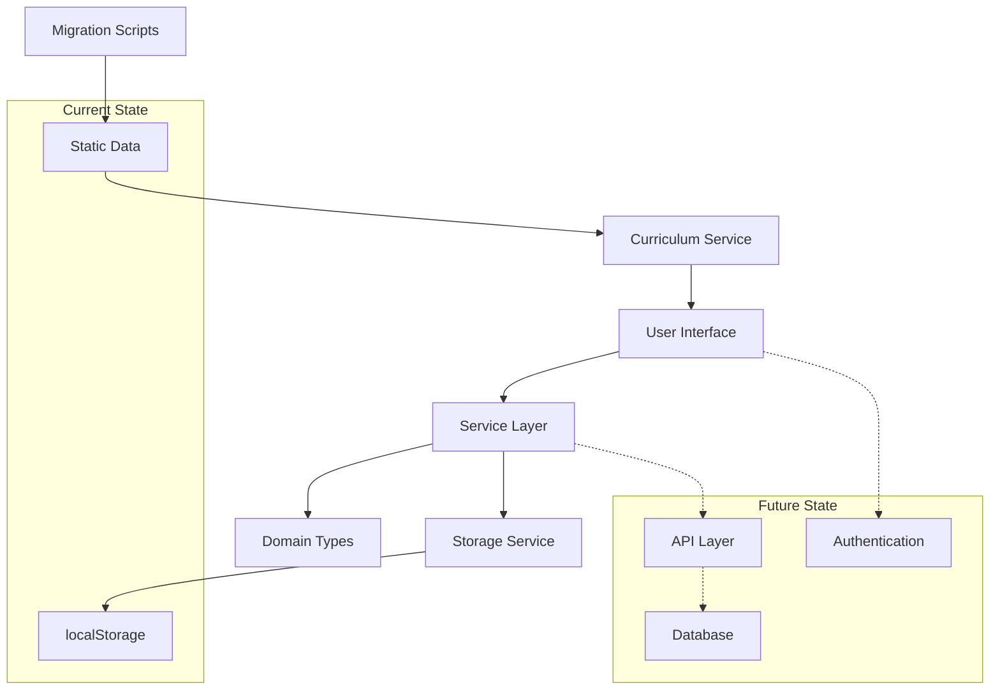

# Streetwise Coach App - Architecture Documentation

## Overview

The Streetwise Coach application is a Next.js-based coaching platform designed for martial arts instruction, specifically focused on Gracie Combatives 2.0 curriculum. The application enables coaches to browse curriculum content, conduct coaching sessions with student assessments, and review session history.

## Current Implementation

### Technology Stack

- **Framework**: Next.js 13.4.8 with App Router
- **Frontend**: React 18.2.0 with TypeScript 5.1.3
- **UI Library**: PrimeReact 10.2.1 (Sakai template)
- **Styling**: PrimeFlex 3.3.1 for responsive grid system
- **Icons**: PrimeIcons 6.0.1
- **State Management**: Client-side localStorage via custom storage service
- **Build Tools**: TypeScript compiler, ESLint, Prettier

### Project Structure

```
streetwise-coach-app-v2/
├── app/                          # Next.js App Router pages
│   ├── (main)/                   # Authenticated application pages
│   │   ├── coach/page.tsx        # Coaching session interface
│   │   ├── curriculum/page.tsx   # Curriculum browser
│   │   ├── dashboard/page.tsx    # Dashboard route
│   │   ├── history/page.tsx      # Session history
│   │   ├── layout.tsx            # Main app layout
│   │   └── page.tsx              # Root dashboard
│   ├── (full-page)/              # Standalone pages (auth, landing)
│   │   ├── auth/                 # Authentication pages
│   │   └── landing/page.tsx      # Marketing landing page
│   ├── api/                      # API routes (future)
│   ├── layout.tsx                # Root layout with providers
│   └── page.tsx                  # Root page redirect
├── core/                         # Business logic and domain
│   ├── domain/                   # TypeScript interfaces and types
│   │   ├── curriculum.types.ts   # Curriculum domain model
│   │   ├── session.types.ts      # Session and observation types
│   │   ├── plan.types.ts         # Lesson planning types
│   │   └── principles.ts         # Core principles definitions
│   ├── services/                 # Business logic services
│   │   ├── curriculumService.ts  # Curriculum data access
│   │   ├── sessionService.ts     # Session management
│   │   └── storageService.ts     # localStorage abstraction
│   └── utils/                    # Utility functions
├── features/                     # Reusable UI components
│   ├── curriculum/               # Curriculum browsing components
│   ├── session/                  # Coaching session components
│   ├── history/                  # Session history components
│   └── students/                 # Student management (future)
├── layout/                       # Sakai template components
│   ├── AppMenu.tsx               # Sidebar navigation
│   ├── AppTopbar.tsx             # Top navigation bar
│   ├── AppSidebar.tsx            # Collapsible sidebar
│   ├── AppFooter.tsx             # Footer component
│   └── context/                  # Layout context providers
├── data/                         # Static data files
│   ├── gc2.curriculum.v1.ts     # Migrated curriculum data
│   └── legacy/                   # Original curriculum files
└── scripts/                      # Build and migration scripts
    └── migrate-gc2.ts            # Curriculum migration tool
```

### Architectural Layers

#### 1. Presentation Layer
- **Location**: `app/*`, `features/*`, `layout/*`
- **Responsibility**: User interface, routing, component composition
- **Key Components**:
  - Next.js App Router for file-based routing
  - PrimeReact components for consistent UI
  - Sakai template for professional layout
  - Feature-based component organization

#### 2. Service Layer
- **Location**: `core/services/*`
- **Responsibility**: Business logic, data access, state management
- **Key Services**:
  - `curriculumService.ts`: Curriculum data retrieval and filtering
  - `sessionService.ts`: Session lifecycle management and observation recording
  - `storageService.ts`: localStorage abstraction with error handling

#### 3. Domain Layer
- **Location**: `core/domain/*`
- **Responsibility**: Business entities, types, and domain rules
- **Key Types**:
  - Curriculum, Lesson, Slice, Step, Drill interfaces
  - CoachingSession, Observation union types
  - Plan, PlanItem for lesson planning

#### 4. Data Layer
- **Location**: `data/*`
- **Responsibility**: Static data storage and migration
- **Current Implementation**: TypeScript constants with migrated curriculum data
- **Future**: Database integration with API endpoints

### Data Flow Architecture



### Current State Management

The application uses a simple but effective client-side state management approach:

1. **Static Data**: Curriculum data is loaded from TypeScript constants
2. **Session Data**: Stored in localStorage with automatic persistence
3. **UI State**: Managed by React hooks and component state
4. **Navigation**: Handled by Next.js App Router

#### Storage Service Implementation

```typescript
// core/services/storageService.ts
export const storage = {
    get<T>(key: string, fallback: T): T {
        try {
            const raw = localStorage.getItem(key);
            return raw ? (JSON.parse(raw) as T) : fallback;
        } catch {
            return fallback;
        }
    },
    set<T>(key: string, value: T) {
        localStorage.setItem(key, JSON.stringify(value));
    },
};
```

## Future Extensibility

### Backend Integration Path

#### Phase 1: API Layer Addition
- Add Next.js API routes in `app/api/*`
- Implement RESTful endpoints for CRUD operations
- Maintain localStorage as fallback for offline capability

#### Phase 2: Database Integration
- PostgreSQL database with Prisma ORM
- User authentication with NextAuth.js
- Real-time updates with WebSocket support

#### Phase 3: Multi-tenant Architecture
- Student management and roster functionality
- Coach-student relationships and permissions
- Progress tracking and analytics

### Database Schema Design

```sql
-- Core entities for future database implementation
CREATE TABLE curricula (
    id VARCHAR PRIMARY KEY,
    name VARCHAR NOT NULL,
    version VARCHAR NOT NULL,
    metadata JSONB,
    created_at TIMESTAMP DEFAULT NOW(),
    updated_at TIMESTAMP DEFAULT NOW()
);

CREATE TABLE lessons (
    id VARCHAR PRIMARY KEY,
    curriculum_id VARCHAR REFERENCES curricula(id),
    lesson_number INTEGER NOT NULL,
    technique VARCHAR NOT NULL,
    position VARCHAR,
    overview TEXT,
    mindset_minute TEXT,
    street_tip TEXT,
    created_at TIMESTAMP DEFAULT NOW()
);

CREATE TABLE slices (
    id VARCHAR PRIMARY KEY,
    lesson_id VARCHAR REFERENCES lessons(id),
    slice_number INTEGER NOT NULL,
    title VARCHAR,
    indicator TEXT,
    essential_detail TEXT,
    most_common_mistake TEXT,
    bad_guy_reminder TEXT,
    is_bonus BOOLEAN DEFAULT FALSE,
    created_at TIMESTAMP DEFAULT NOW()
);

CREATE TABLE steps (
    id VARCHAR PRIMARY KEY,
    slice_id VARCHAR REFERENCES slices(id),
    step_number INTEGER NOT NULL,
    description TEXT NOT NULL,
    created_at TIMESTAMP DEFAULT NOW()
);

CREATE TABLE coaching_sessions (
    id UUID PRIMARY KEY,
    coach_id VARCHAR NOT NULL,
    session_type VARCHAR NOT NULL CHECK (session_type IN ('private', 'group')),
    student_ids JSONB,
    plan_id VARCHAR,
    started_at TIMESTAMP NOT NULL,
    ended_at TIMESTAMP,
    duration_seconds INTEGER,
    coach_notes TEXT,
    created_at TIMESTAMP DEFAULT NOW()
);

CREATE TABLE observations (
    id UUID PRIMARY KEY,
    session_id UUID REFERENCES coaching_sessions(id),
    observation_type VARCHAR NOT NULL,
    student_id VARCHAR,
    target_id VARCHAR NOT NULL, -- slice_id or step_id
    confidence INTEGER CHECK (confidence BETWEEN 1 AND 3),
    notes TEXT,
    next_action VARCHAR CHECK (next_action IN ('Teach', 'Review', 'Reteach')),
    timer_label VARCHAR,
    timer_start INTEGER,
    timer_stop INTEGER,
    created_at TIMESTAMP DEFAULT NOW()
);
```

### Authentication Strategy

#### NextAuth.js Integration
```typescript
// app/api/auth/[...nextauth]/route.ts
import NextAuth from 'next-auth'
import GoogleProvider from 'next-auth/providers/google'
import CredentialsProvider from 'next-auth/providers/credentials'

export const authOptions = {
  providers: [
    GoogleProvider({
      clientId: process.env.GOOGLE_CLIENT_ID,
      clientSecret: process.env.GOOGLE_CLIENT_SECRET,
    }),
    CredentialsProvider({
      name: 'credentials',
      credentials: {
        email: { label: 'Email', type: 'email' },
        password: { label: 'Password', type: 'password' }
      },
      async authorize(credentials) {
        // Custom authentication logic
        return null
      }
    })
  ],
  pages: {
    signIn: '/auth/login',
    error: '/auth/error',
  },
  callbacks: {
    async session({ session, token }) {
      // Add custom session data
      return session
    },
    async jwt({ token, user }) {
      // Add custom JWT data
      return token
    }
  }
}

export default NextAuth(authOptions)
```

### Real-time Collaboration

#### WebSocket Integration
```typescript
// core/services/realtimeService.ts
export class RealtimeService {
  private ws: WebSocket | null = null
  
  connect(sessionId: string) {
    this.ws = new WebSocket(`ws://localhost:3001/sessions/${sessionId}`)
    
    this.ws.onmessage = (event) => {
      const data = JSON.parse(event.data)
      this.handleRealtimeUpdate(data)
    }
  }
  
  sendObservation(observation: Observation) {
    if (this.ws?.readyState === WebSocket.OPEN) {
      this.ws.send(JSON.stringify({
        type: 'observation',
        data: observation
      }))
    }
  }
  
  private handleRealtimeUpdate(data: any) {
    // Handle incoming real-time updates
  }
}
```

## Performance Considerations

### Current Optimizations
- Static curriculum data loaded at build time
- Client-side caching with localStorage
- PrimeReact component lazy loading
- Next.js automatic code splitting

### Future Optimizations
- Server-side rendering for curriculum pages
- Database query optimization with indexes
- CDN integration for static assets
- Progressive Web App (PWA) capabilities

## Security Considerations

### Current Security
- Client-side data validation with TypeScript
- XSS protection via React's built-in escaping
- CSRF protection via Next.js defaults

### Future Security Enhancements
- JWT-based authentication
- Role-based access control (RBAC)
- API rate limiting
- Data encryption at rest and in transit
- Audit logging for sensitive operations

## Deployment Strategy

### Current Deployment
- Static site generation with Next.js
- Hosting on Vercel or similar platform
- Environment variables for configuration

### Future Deployment
- Containerized deployment with Docker
- Kubernetes orchestration for scalability
- CI/CD pipeline with automated testing
- Blue-green deployment strategy
- Database migration management

## Monitoring and Observability

### Current Monitoring
- Browser console logging
- localStorage error handling
- Basic error boundaries

### Future Monitoring
- Application Performance Monitoring (APM)
- Error tracking with Sentry
- User analytics and behavior tracking
- Database performance monitoring
- Real-time alerting for critical issues

## Migration Strategy

### Phase 1: Preparation (Current)
- ✅ Establish clear architecture documentation
- ✅ Implement comprehensive domain model
- ✅ Create detailed UX flow documentation
- ✅ Set up development tooling and standards

### Phase 2: Backend Foundation
- Add API routes for data operations
- Implement database schema
- Set up authentication system
- Create data migration scripts

### Phase 3: Feature Enhancement
- Add student management
- Implement lesson planning
- Create progress tracking
- Add analytics dashboard

### Phase 4: Scale and Optimize
- Implement real-time features
- Add mobile responsiveness
- Optimize performance
- Deploy production infrastructure

This architecture provides a solid foundation for the current application while establishing clear paths for future growth and scalability.
